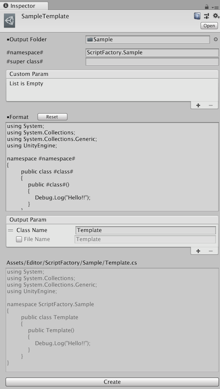

# ScriptFactory
Create C# script from template

## Feature
* Create template and C# script
* Define custom property
* Preview output

## Usage
1. Import ScriptFactoryPackage.unitypackage
2. Create template (MenuItem("Create/Script Factory Template"))
3. Edit template (namespace, super class, format, and any custom properties ...)
4. Set class name (and file name)
5. Select create button

## Licence

MIT

## Author

[Syy9](https://github.com/Syy9)
